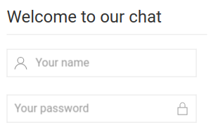

# vuejs-chat

Just a simple chat.

## Features

* Group chat
* Stickers
* Chart with ages of users (statistics)

## API

* Users data (CRUD) - REST
* Chat - sockets
* Information for charts - REST

## Launch

Install dependencies:

```bash
npm install
```

### Dev

Starts server at `localhost:3000` with autoreload:

```bash
npm run start
```

Or just build and run:

```bash
npm run build
node stubs/index.js
```

And open `localhost:3000`. You can change address in `src/config.js` and share the provided port. 
After anybody can join the chat at `{your-ip:your-port}`.

## Chat

Log in or register here:



And just chat:


# TODO

* Users profile pictures
* Attachments
* Turn stub server into a good server 